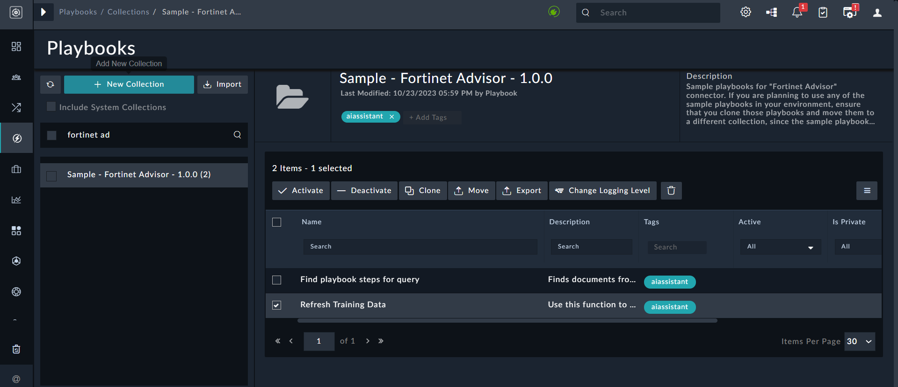
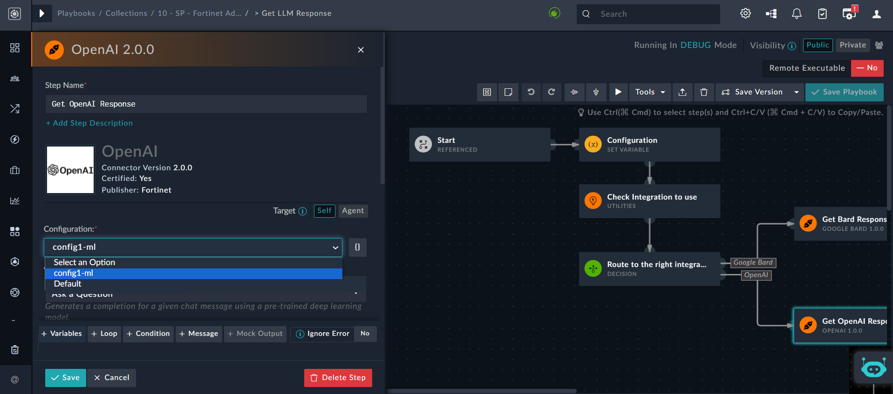
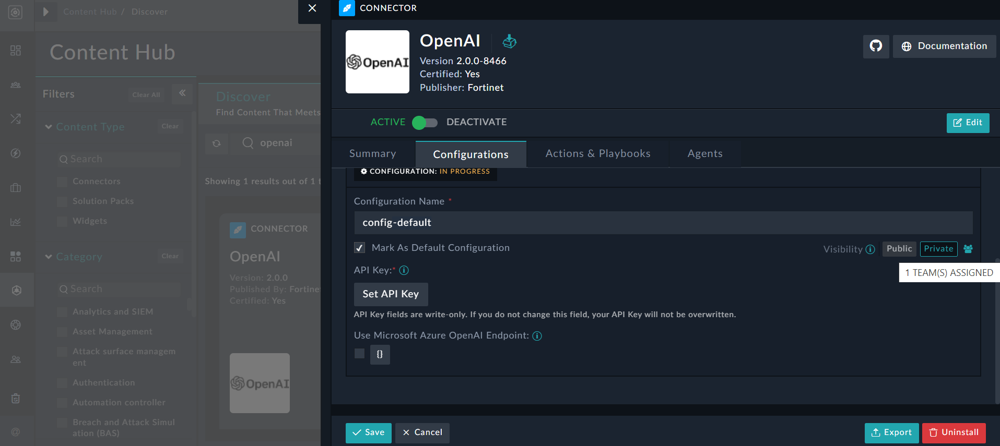

| [Home](../README.md) |
|--------------------------------------------|

# Advanced Usage

## Prompting tips

Simple tweaks to the input prompts could improve the playbook block generation process using Fortinet Advisor. While asking queries or giving input to Advisor keep the some tips in mind:

- To use a specific integration in a use case, provide it as part of the prompt. For example, use “Get IP Reputation using VirusTotal” instead of just “Get IP Reputation”. When it comes to the latter, Advisor will include any enrichment source such as IP Quality Score, AlienVault-OTX, or VirusTotal, etc.   
  You must also ensure that any connector specified in the prompt is installed on your system. 
- To create playbooks intended to add a record in FortiSOAR, avoid using "Create <module name> record" as the first step. Instead, place it in the following step after gathering details from a previous action. For example, use "Fetch Unread Emails from Exchange and create Alert record".
- To update a record in FortiSOAR with some value, use "Update <module name>....". For example, "Update Alert Severity to Critical" works better than "Increase Alert Severity to Critical". 
- To create playbooks with On Create, On Update, or On Delete triggers, add terms such as 'On create/on update/on delete of <module name> record, perform further <actions>...'. For example, On Create of alert add a comment "Hello, Analyst!"
- To create playbooks with manual triggers, use 'Manual Trigger on <module name>, perform further <actions>...' For example, Manually trigger a playbook upon a Phishing type Alert Record to change the status to Investigating.
- To create playbooks with manual inputs, add terms such as 'Prompt the user for further <actions>...' For example, Check the reputation of the indicator using VirusTotal and prompt the user for action: either block it or take no action.
- To create playbooks with decision blocks, use If...else statements, For example, Check the IP's reputation using VirusTotal. If it's considered malicious, set the indicator reputation as malicious else. If it's considered suspicious, set the indicator reputation as suspicious. Else, set the indicator reputation as good.

## Utilizing your own playbook collections to train the solution

By default, Fortinet Advisor is trained using the large collection of use cases available on the [FortiSOAR Content Hub](https://fortisoar.contenthub.fortinet.com/list.html). 

Simultaneously, we recognize that every organization develops automated content according to its own style and naming practice. You can add your own playbook collections to the Advisor's training set to have it speak your language when creating the playbook blocks.

  >**NOTE**: To achieve better training results, the playbook collections used for training must have appropriate step names with clear descriptions. This is because Advisor uses these to generate the response playbook and steps. Additionally, when asking Advisor to generate playbooks, it is recommended to use similar step names or keywords as those used in your trained playbook collections. For example, if 'Indicators' are used in step names, then do not use 'IOCs'.

Use the following steps to update the training using your playbook collections: 

1. Log onto FortiSOAR.
2. Navigate to **Settings** > **Application Editor** > **Export Wizard**.
3. On the `Export Wizard` page, click **New Template** to create a template that contains playbook collections you want to add as part of the training:  
   
4. Select the playbook collections to be included for the training, provide an appropriate name for the export, and then click **Save and Run Export** to complete the export process. 
5. Download the exported file.  
   The exported file is the latest entry in the **Export History** tab. Capture its unique identifier, as shown in the following image:  
   
6. Click **Automation** > **Playbooks** and search for `Fortinet Advisor`.
7. Open the 'Sample - Fortinet Advisor - 1.0.0' playbook collection and clone the 'Refresh Training Data' playbook:  
   
8. Open the 'Refresh Training Data' playbook and click the **Refresh Training Data** step. In the **Export File IRI** box, enter the file IRI to the value you had captured in step 5, and save the step and the playbook: 
   
9. Run the updated playbook.  
   Once this playbook is successfully executed, your selected custom playbook collections become part of the training dataset.

## How to use an alternate connector configuration?

To use the connector configuration other than the default configuration to get responses from the LLM, follow these steps:

1. Go to the '10 - SP - Fortinet Advisor' playbook collection and click the > 'Get LLM Response' playbook to open the same in the playbook designer.
2. In the  'Get LLM Response' playbook, double-click the 'Get OpenAI Response' connector step, and select the configuration you want to use:  
   
3. Click **Save** to save the updated connector configuration and then click **Save Playbook** to save the playbook.  

## How to restrict access to Advisor?

To restrict access to Advisor by specifying the teams that are authorized to use the OpenAI connector, perform the following steps:

1. To limit access, open the OpenAI configuration, mark its **Visibility** as **Private**, and then click the **Ownership** icon:  
   
2. In the **Assign Owners** dialog, you will see that the logged-in user's teams are automatically assigned ownership. To remove ownership of any team, click the **Red Cross** beside its name; similarly, to assign ownership to any team, select the team from the **Owners** drop-down list, click **Assign** and then click **Submit**:  
     
3. Mark the following playbooks in the '10 - SP - Fortinet Advisor' playbook collection as **Private** and assign their ownership to the same teams that are assigned as owners in the OpenAI connector.
   - Generate WorkPlan For User Input
   - Get Playbook Block Suggestion
   - Converse with LLM  
     To mark a playbook, for example, the "Converse with LLM" playbook, as 'Private' and restrict its visibility to specific teams, follow these steps:
     1. Open the Converse with LLM playbook in the playbook designer, and in the top bar, mark its **Visibility** as **Private**, and then click the **Ownership** icon.  
          
     2. In the **Assign Owners** dialog, assign the ownership of the playbook to the same teams that are assigned as owners in the OpenAI connector, and then click **Submit**.   
        Once the teams are assigned in both the playbooks and the OpenAI connector, only those teams will have access to the OpenAI connector and will be able to receive responses from Fortinet Advisor.

## How to update the OpenAI Model for use by Advisor?

You can choose the OpenAI Model that you want Advisor to use by editing the `OpenAI_Model` global variable. By default, Advisor uses the 'gpt-4-1106-preview' model.

To update the OpenAI Model used by Advisor, follow these steps:

1. Log onto FortiSOAR.
2. Navigate to **Automation** > **Playbooks**. 
3. Select any playbook to open the Playbook Designer.
4. In the Playbook Designer, click **Tools** > **Global Variables**.
5. In the Global Variables dialogue, search for `OpenAI_Model`. 
6. Click **Edit** in the OpenAI_Model row to set the value of the OpenAI Model you want to use:   
   

## Troubleshooting

### Advisor bot not visible

The Advisor bot is not visible after installing the Fortinet Advisor solution pack.

**Resolution**

To resolve this issue, either force a browser refresh or log out and log back in to your FortiSOAR instance.

### Advisor flyout does not open

The Advisor flyout does not launch, or Advisor does not display any response for the playbook outline.

**Resolution**

To resolve this issue, check if the user is assigned appropriate permissions. To utilize the Fortinet Advisor solution pack, users must have the following permissions, along with other appropriate permissions:

- Read and Usage permissions on Widgets
- Read and Execute permissions on Playbooks

### Advisor is unable to generate playbook steps

Based on your prompt, the Advisor is unable to generate the playbook steps.

**Resolution**

To resolve this issue, try the following:

- Try to regenerate the steps.
- Rephrase the prompt and try to generate the playbook steps, see [Prompting tips](#prompting-tips).
- Verify that your OpenAI account is operational and has enough credit.

| [Installation](./setup.md#installation) | [Configuration](./setup.md#configuration) | [Contents](./contents.md) |
|-----------------------------------------|-------------------------------------------|---------------------------|