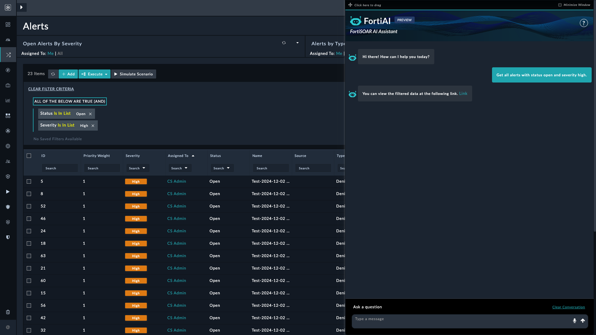
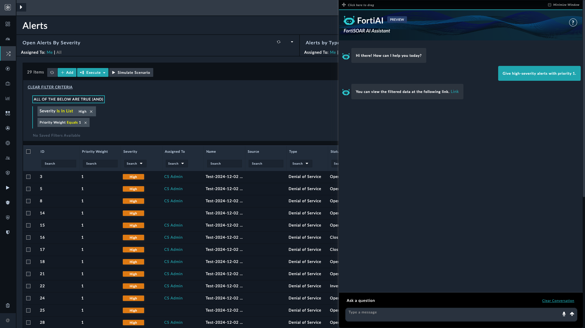
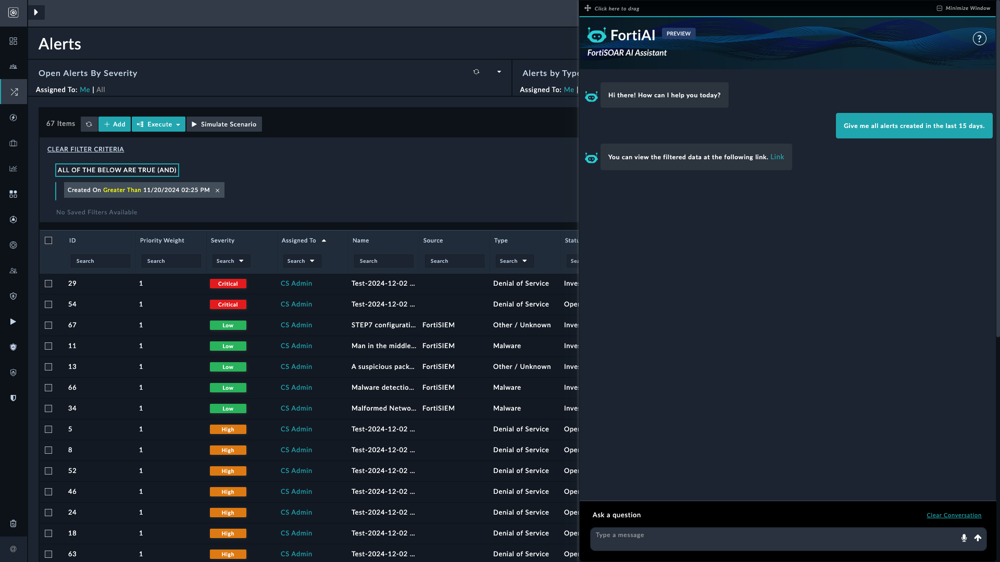

| [Home](../README.md) |
|----------------------|

# Filtering alerts through prompts

This guide contains prompts that focus on filtering active and historical alerts to streamline threat investigation and response. Prompts in this section allow users to retrieve alerts based on criteria such as severity, status, priority, or assigned user, providing a targeted view of alerts under investigation or requiring immediate attention.

### Example: Retrieve alerts under investigation

This section demonstrates prompts for isolating alerts whose *Status* is **Investigating**. This example provides prompts along with the expected outcome, helping users quickly access alerts that require further analysis or follow-up actions.

* **Prompt**:

    > _"Filter out all the alerts which are currently under investigation."_

* **Expected Outcome**: Displays only alerts whose *Status* is **Investigating**.

#### Review results

Verify that the results include only alerts marked as **Investigating**, ensuring that irrelevant alerts are excluded as per the filtering criteria.

### Example: Retrieve high-severity open alerts

This example demonstrates how to filter alerts based on both severity and status, helping users prioritize urgent, unresolved cases.

* **Prompt**:  
   > _"Get all alerts with status open and severity high."_

* **Expected Outcome**:  
   Displays only alerts with a *Status* of **Open** and a severity of **High**.

#### Review results

Verify that the results include only high-severity open alerts.

### Example: Retrieve high-severity priority 1 alerts

This example demonstrates how to filter alerts based on both severity and priority, helping users prioritize urgent cases.

* **Prompt**:  
   > _"Give high-severity alerts with priority 1."_

* **Expected Outcome**:  
   Displays only alerts with a *Priority Weight* of **1** and a *Severity* of **High**.

### Review results

Verify that the results include only alerts with priority weight of 1 and a severity of high.

### Example: Retrieve alerts assigned to me

This example demonstrates how to filter alerts that are assigned to the current user, allowing you to quickly view alerts requiring your attention.

* **Prompt**:  
   > _"Give alerts assigned to me."_

* **Expected Outcome**:  
   Displays only alerts that are assigned to the currently logged-in user.

### Review results

Verify that the results include only the alerts that are assigned to the current user, ensuring no other alerts are included.

### Example: Retrieve alerts generated between a date range

This example demonstrates how to filter alerts based on a specific date range, helping users focus on alerts generated within a defined time period.

* **Prompt**:  
   > _"Give me all alerts generated in the last 15 days."_

* **Expected Outcome**:  
   Displays only alerts that were generated between the specified date range.

### Review Results

Verify that the results include only alerts generated within the specified date range, ensuring no alerts outside the period are displayed.

### Other examples

Similarly, you can use the following prompts to filter alert records.

1. Give me alerts assigned to <user-1>.
 
2. Give me all alerts generated between October 1, 2024, and October 15, 2024
 
3. Show me all alerts where the *severity* is either high or critical, the status is open or in progress, and the type is malware or phishing. The alerts should have been created on within the last 7 days, and the source IP should start with '192.168.1.
 
4. List all in-progress alerts, excluding those of the phishing or suspicious type.

# Next Steps

| [Installation](./setup.md#installation) | [Configuration](./setup.md#configuration) | [Usage](./usage.md) | [Contents](./contents.md) |
| --------------------------------------- | ----------------------------------------- | ------------------- | ------------------------- |
