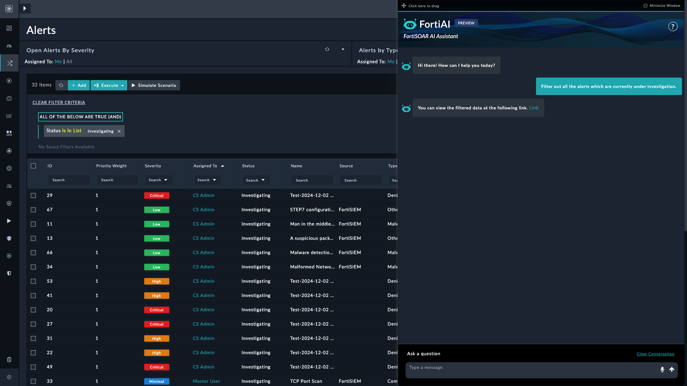
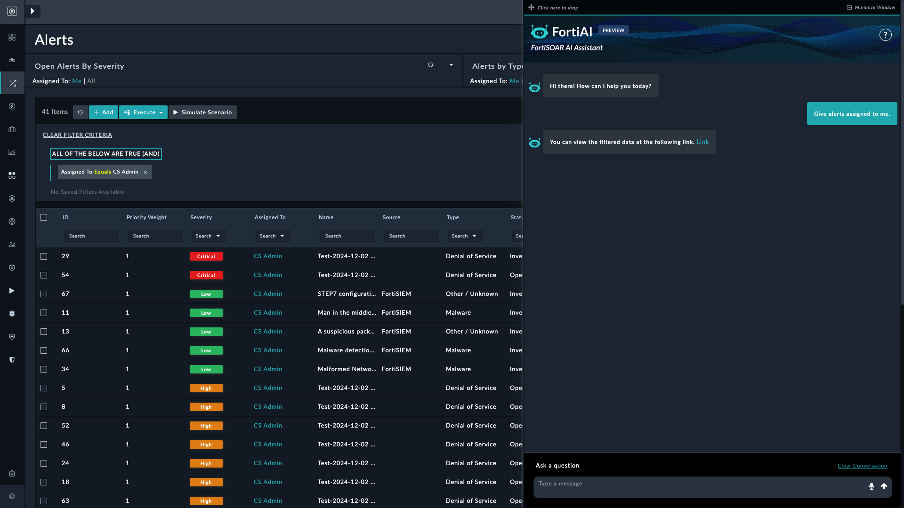

| [Home](../README.md) |
|----------------------|

# Filtering Records

This guide contains prompts for efficiently filtering records using the FortiAI Assistant. Each prompt focuses on specific filtering criteria, allowing users to retrieve relevant data quickly. Some prompts include screenshots to help illustrate expected outcomes.

## Alerts

The Alerts section focuses on filtering active and historical alerts to streamline threat investigation and response. Prompts in this section allow users to retrieve alerts based on criteria such as severity, status, priority, or assigned user, providing a targeted view of alerts under investigation or requiring immediate attention.

### Example: Retrieve Alerts Under Investigation

This section demonstrates prompts for isolating alerts whose *Status* is **Investigating**. This example provides prompts along with the expected outcome, helping users quickly access alerts that require further analysis or follow-up actions.

* **Prompt**:

    > _"Filter out all the alerts which are currently under investigation."_

* **Expected Outcome**: Displays only alerts whose *Status* is **Investigating**.

#### Review results

Verify that the results include only alerts marked as **Investigating**, ensuring that irrelevant alerts are excluded as per the filtering criteria.

### Example: Retrieve high-severity open alerts

This example demonstrates how to filter alerts based on both severity and status, helping users prioritize urgent, unresolved cases.

* **Prompt**:  
   > _"Get all alerts with status open and severity high."_

* **Expected Outcome**:  
   Displays only alerts with a *Status* of **Open** and a severity of **High**.

#### Review results

Verify that the results include only high-severity open alerts.

### Example: Retrieve High-Severity Priority 1 Alerts

This example demonstrates how to filter alerts based on both severity and priority, helping users prioritize urgent cases.

* **Prompt**:  
   > _"Give high-severity alerts with priority 1."_

* **Expected Outcome**:  
   Displays only alerts with a *Priority Weight* of **1** and a *Severity* of **High**.

### Review Results

Verify that the results include only alerts with priority weight of 1 and a severity of high.

### Example: Retrieve Alerts Assigned to Me

This example demonstrates how to filter alerts that are assigned to the current user, allowing you to quickly view alerts requiring your attention.

* **Prompt**:  
   > _"Give alerts assigned to me."_

* **Expected Outcome**:  
   Displays only alerts that are assigned to the currently logged-in user.

### Review Results

Verify that the results include only the alerts that are assigned to the current user, ensuring no other alerts are included.

# Next Steps

| [Installation](./setup.md#installation) | [Configuration](./setup.md#configuration) | [Usage](./usage.md) | [Contents](./contents.md) |
| --------------------------------------- | ----------------------------------------- | ------------------- | ------------------------- |
